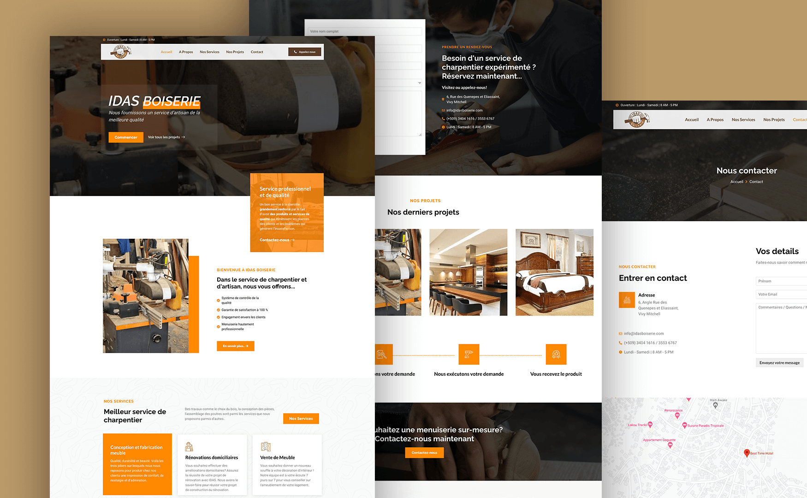
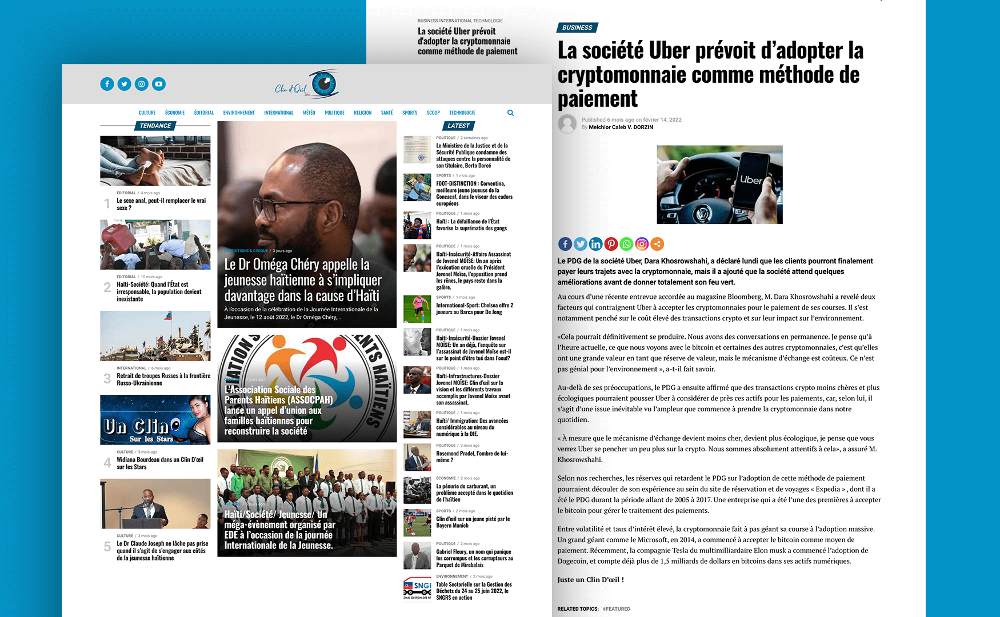
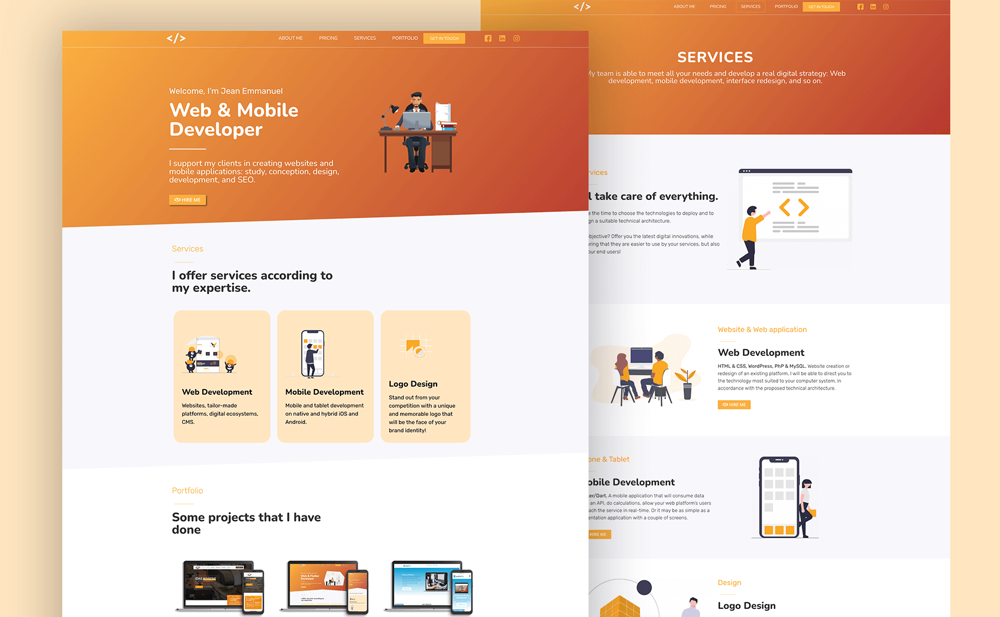
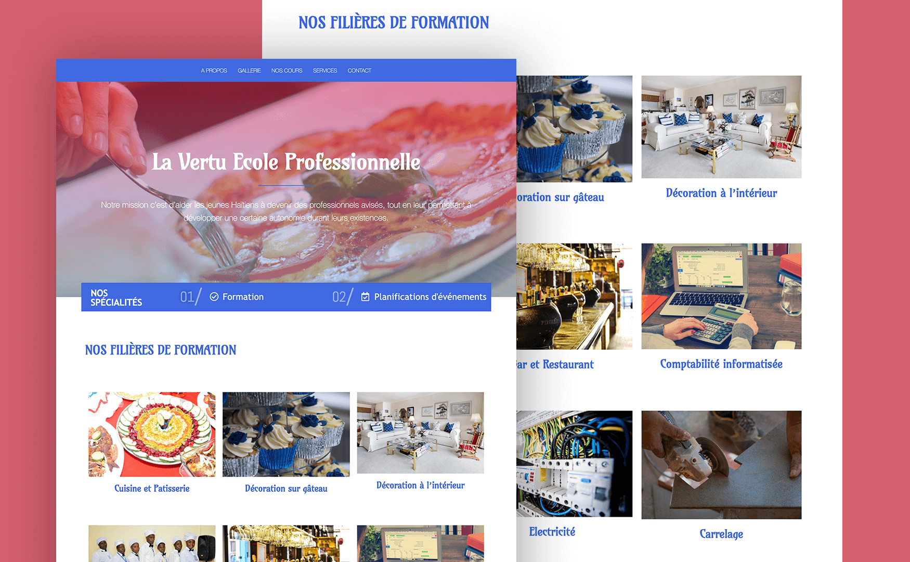
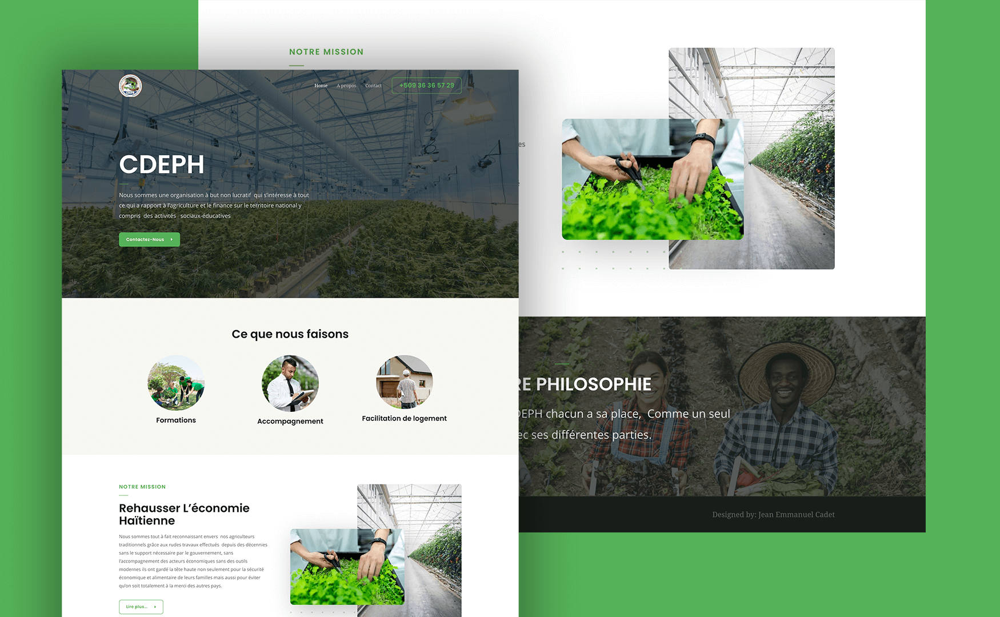
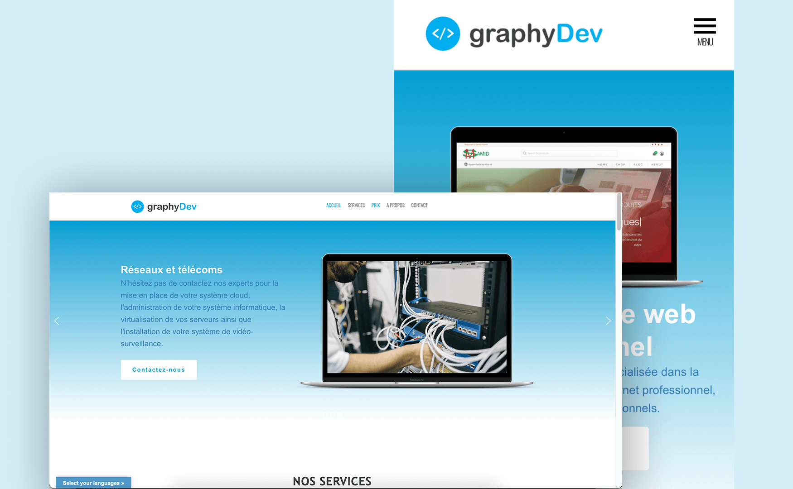

# Hi 👋, I'm **Jean Emmanuel CADET** | A Full-stack Software Engineer

  

## About Me

I’m a passionate and versatile full-stack software engineer with extensive experience in building robust and scalable applications. My primary expertise lies in Ruby and Ruby on Rails, complemented by a strong command of PostgreSQL as my go-to database.

Over the years, I’ve expanded my skill set to include a diverse array of technologies, ensuring I can tackle any challenge that comes my way. I’m proficient in front-end development with React.js and Next.js, and have a solid understanding of JavaScript and TypeScript. On the back end, I have hands-on experience with Node.js, and I’m well-versed in both relational databases like MySQL and NoSQL databases like MongoDB. Additionally, I’ve dabbled in mobile app development using Flutter, allowing me to create seamless user experiences across platforms.

I am always eager to collaborate on innovative projects, whether it’s building a new application from the ground up or improving and scaling existing systems. My approach to development is not just about writing code, but about delivering solutions that drive success and growth for my clients and partners.

Let’s connect and explore how we can work together to bring your ideas to life. I’m open to contract opportunities, project collaborations, and full-time roles. 

Feel free to reach out to me for any software development needs or to discuss the latest trends in tech.

## Skills

* Languages: `Ruby`, `JavaScript`, `TypeScript`
* Libraries & Frameworks: `Ruby on Rails`, `Next.js`, `Node.js`, `Express.js`, `React js`, `Redux`, `Redux Toolkit`, `Bootstrap`, `Tailwind CSS`, `Flutter`
* Databases: `PostgreSQL`, `MySQL`, `MongoDB`
* Technologies & Other: `Git`, `AWS`, `REST API Development`, `TDD`, `RSpec`, `Capybara`, `Jest`, `React Testing Library`

<!--
## Some examples of my works

### Website

-->

## Stats

&nbsp;

